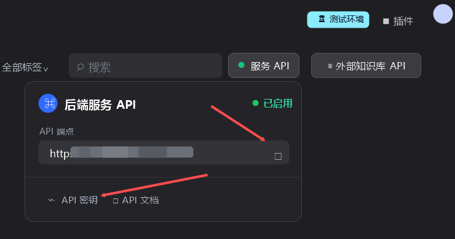
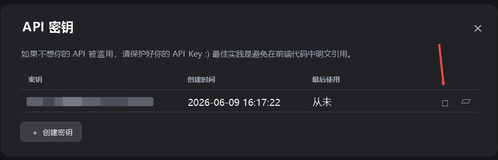
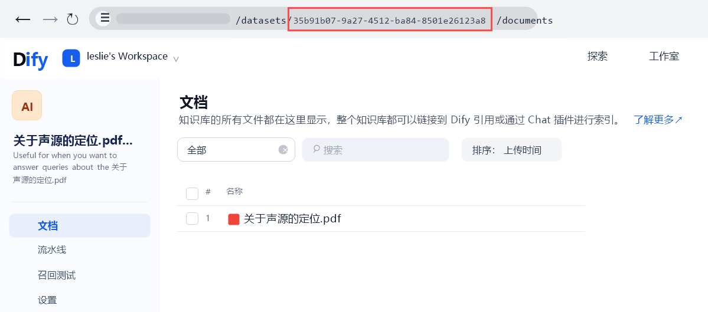

# Dify Knowledge Plugin

Tool plugin for the Dify Knowledge API. It lets you inspect knowledge bases, inspect documents, retrieve chunks, and query the available models used for knowledge-base configuration.

中文说明见 [readme/README_zh_Hans.md](readme/README_zh_Hans.md)。

## Features

- `list_datasets`: list knowledge bases with optional keyword, pagination, permission, and tag filters.
- `list_documents`: list documents in a knowledge base with optional keyword, status, and pagination filters.
- `retrieve_chunks`: retrieve normalized chunk results from a knowledge base.
- `list_available_models`: query available Dify models by type, especially `text-embedding` and `rerank` for knowledge-base setup.

## Credentials

- `Base URL`: Dify Knowledge API base URL. Both `https://your-dify-host/v1` and `https://your-dify-host` are accepted. The plugin normalizes the latter to `/v1`.
- `API Key`: Dify Service API key with access to the target workspace knowledge resources.

### Getting Credentials

Open the Service API panel in Dify, then copy the API endpoint into the plugin `Base URL` field.

Click `API Key` in the Service API panel, then copy the key from the API key dialog into the plugin `API Key` field.

## Tool Reference

### `list_datasets`

Used to inspect available knowledge bases before retrieval or document lookup.

- `keyword`: optional name filter.
- `page`: optional page number, defaults to `1`.
- `limit`: optional page size, defaults to `20`.
- `include_all`: optional flag to include all visible knowledge bases regardless of permission scope.
- `tag_ids`: optional comma-separated list or JSON array string of tag ids.

### Getting `dataset_id`

Open a knowledge base in Dify and copy the UUID between `/datasets/` and `/documents` from the browser address bar.

### `list_documents`

Used to inspect documents inside a specific knowledge base.

- `dataset_id`: required knowledge base id.
- `keyword`: optional document-name filter.
- `status`: optional status filter.
- `page`: optional page number, defaults to `1`.
- `limit`: optional page size, defaults to `20`.

### `retrieve_chunks`

Used to retrieve relevant chunks from a specific knowledge base.

Optional retrieval parameters only affect the current request and are not saved to the knowledge base. If an optional retrieval parameter is left empty, Dify uses the retrieval configuration already saved in that knowledge base.

- `dataset_id`: required knowledge base id.
- `query`: required search query.
- `search_method`: optional retrieval-method override for internal knowledge bases.
- `top_k`: optional result-count override.
- `score_threshold_enabled` and `score_threshold`: optional similarity-threshold overrides.
- `reranking_enable` and `reranking_mode`: optional reranking overrides for internal knowledge bases.
- `reranking_provider_name` and `reranking_model_name`: required when `reranking_mode` is `reranking_model`. Available values can be obtained from `list_available_models` with `model_type=rerank`.
- `weight_type`, `vector_weight`, and `keyword_weight`: optional hybrid-search weight overrides.
- `attachment_ids`: optional comma-separated list or JSON array string of attachment ids.

### `list_available_models`

Wraps Dify's "Get Available Models" endpoint: `GET /workspaces/current/models/model-types/{model_type}`.

- `model_type`: required model type. Supported values are `text-embedding`, `rerank`, `llm`, `tts`, `speech2text`, and `moderation`.
- Output: normalized provider groups with `provider_count`, total `model_count`, and each provider's `models` list.

## Notes

- The model-list tool is mainly useful when you need to know which `text-embedding` or `rerank` values can be used in knowledge-base configuration.
- The retrieval tool only sends retrieval-model overrides when you explicitly provide them. These overrides are request-scoped and do not change the saved knowledge-base configuration.
- CSV strings like `a,b,c` and JSON array strings like `["a","b","c"]` are both accepted for list-style parameters such as `tag_ids` and `attachment_ids`.

## Support

If this plugin is helpful, a GitHub Star is appreciated. For bugs, questions, or feature requests, please open an Issue with your Dify version, plugin version, and the steps to reproduce the problem.
